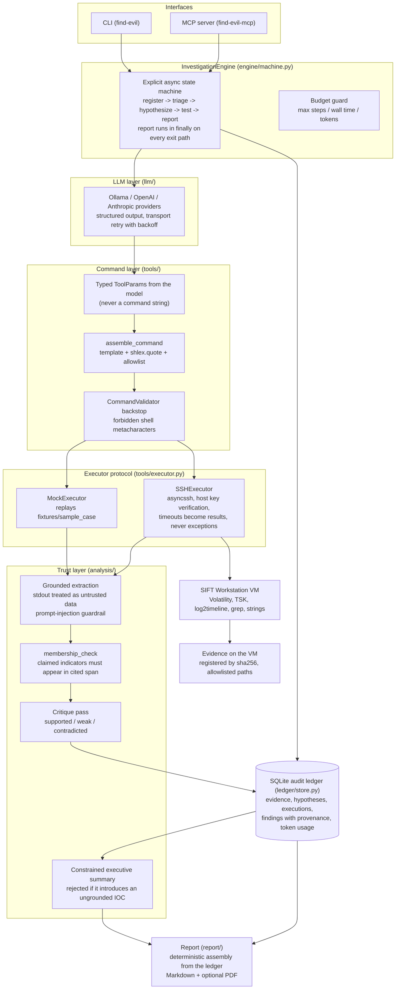

# Architecture

The Find Evil Agent is an autonomous DFIR agent for the SANS SIFT Workstation.
One engine owns the investigation. Interfaces are thin adapters. Every finding
is traceable through the SQLite ledger to the exact tool execution that
produced it.

A rendered diagram is provided at `docs/architecture-diagram.svg`. The same
structure is shown below in Mermaid for maintainers.

## Security boundaries

1. **Model to shell.** The LLM never writes a command string. It returns typed
   `ToolParams`; code assembles the command from a template in
   `tools/metadata.yaml` with `shlex.quote` on every slot, an evidence path
   allowlist, and a metacharacter validator as a backstop. There is no code
   path that executes free-text model output. (ADR 0002)
2. **Tool output to model.** All tool stdout is treated as untrusted data. The
   analyzer prompt forbids following directives found in output, and a
   pattern guardrail surfaces instruction-like content as a suspicious
   artifact instead of acting on it.
3. **Model to report.** A `Finding` cannot be constructed without provenance
   (execution id plus evidence span). A deterministic membership check drops
   findings whose claimed indicators do not appear in the cited output. The
   executive summary is rejected if it introduces any IOC absent from the
   verified findings. (ADR 0003)
4. **Transport.** SSH host key verification is on by default. Key
   authentication is preferred. Evidence is hashed on the VM in ssh mode; the
   agent never reads evidence locally.

## Data flow in one run

incident text + evidence paths -> evidence registration (sha256) -> triage
(ground truth from mmls / fsstat) -> hypotheses (falsifiable, MITRE-mapped) ->
per-hypothesis tool tests (typed params -> template command -> execution ->
grounded extraction -> verification -> critique) -> ledger -> deterministic
report with findings, execution log, constrained summary, and IOCs.

## Decisions

Architecture decisions are recorded in `docs/adr/`:

- 0001 Explicit state machine, not a graph framework
- 0002 Template command assembly, model fills typed slots
- 0003 Findings require provenance
- 0004 Mock-first executor behind a protocol
- 0005 One engine, thin interfaces
